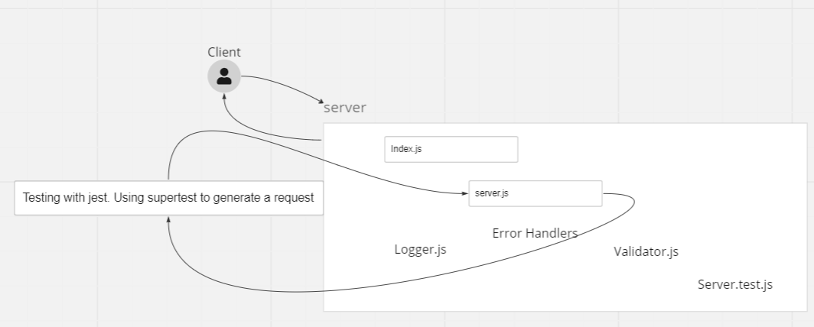

# LAB - Class 02

## Project: basic-express-server

### Author: Rafael Aldana

### Problem Domain

From a business requirements standpoint, we will be building a basic Express server using best practices, including server modularization, use of middleware, and tests.

### Links and Resources

- [GitHub Actions ci/cd](https://github.com/Rafael-Aldana/basic-express-server/actions/new)
- [back-end server dev url](https://github.com/Rafael-Aldana/basic-express-server/tree/dev)
- [back-end server prod url](https://github.com/Rafael-Aldana/basic-express-server)

### Setup

#### `.env` requirements (where applicable)

for now I have none and do not require one

#### How to initialize/run your application (where applicable)

- e.g. `npm start` `nodemon`

#### How to use your library (where applicable)

#### Features / Routes

- Feature One: deploy Dev

#### Tests

- How do you run tests? npm test npm run test npm watch test
- Any tests of note? Tested the following
Assert the following
404 on a bad route
404 on a bad method
500 if no name in the query string
200 if the name is in the query string
given an name in the query string, the output object is correct
- Describe any tests that you did not complete, skipped, etc

#### UML

